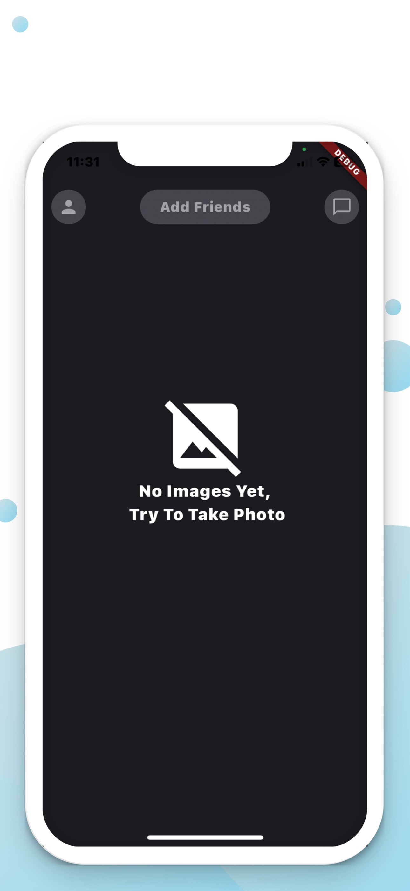
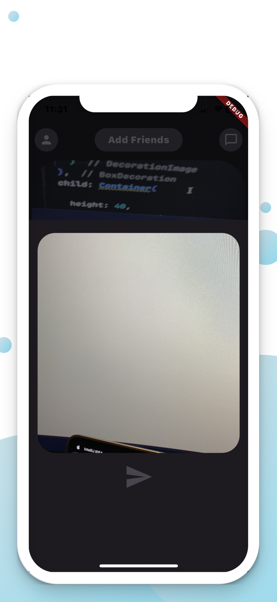
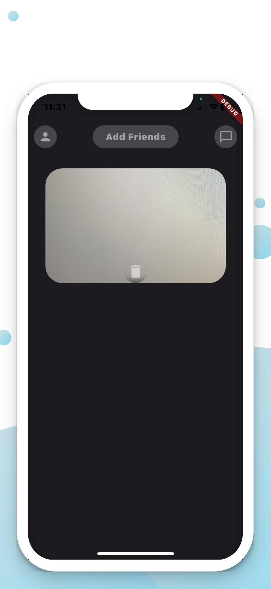
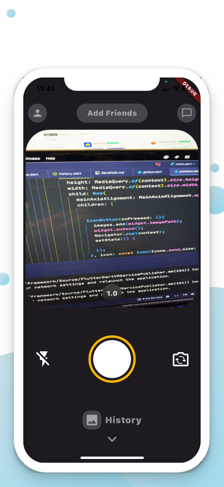

# Locket Clone

A new Flutter project.
------------------
### 👨‍💻 *Developed  by:*

**Nasr Al-Rahbi [@abom_me](https://twitter.com/abom_me)**

## 👨🏻‍💻 Find me in  :

---------------
 
## Getting Started
Locket Clone is a mobile application that allows users to share their photos and videos with their friends and family. Users can also chat with their friends and family. This application is built using Flutter.

## Features
- [x] Zoom in and out of the camera by your fingers
- [x] Take photos
- [x] Double tap to switch between front and back camera
- [x] Enable and disable flash
- [x] Preview of the photo taken
- [x] Swipe up to view photos you took

## Screenshots

